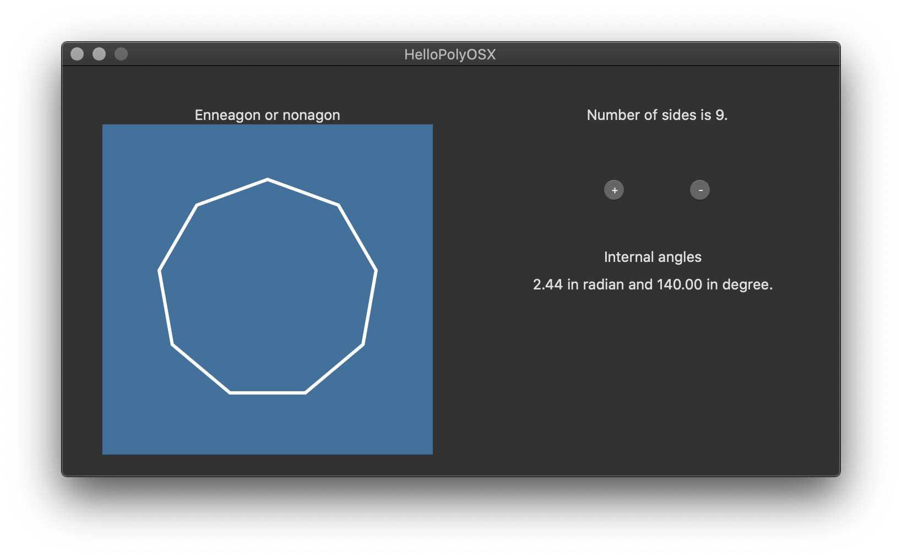

# HelloPolyOSX
A Stanford [project](https://web.stanford.edu/class/cs193p/cgi-bin/drupal/system/files/assignments/Assignment2B-Walkthrough.pdf) from 2010: "I need to practise Cocoa/ObjC and couldn't find any project with sense so decided to stick to Stanford's HelloPoly. Long time back I managed to write the same on iOS so it is high time to try it on OS X."

